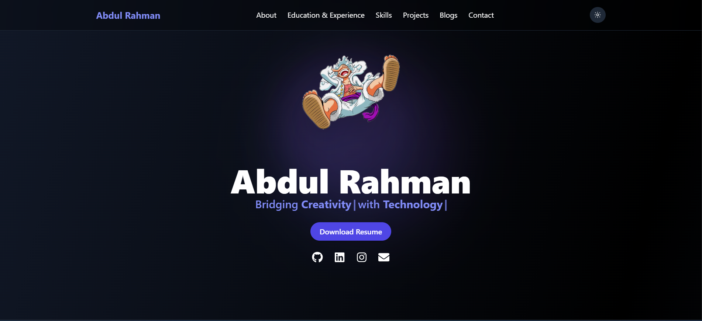
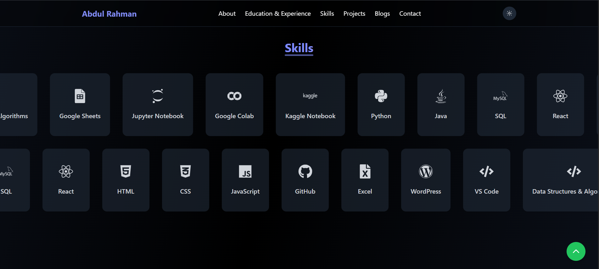
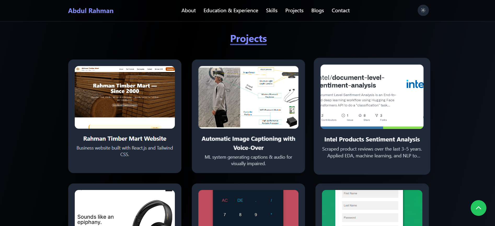

# ☕ Coffee With Abdul – My Portfolio

Hey! I’m Abdul, and this is my little corner of the internet where I show off what I’m building.  
This portfolio is made with **React**, and yes — I put it online using **Netlify**, so you can poke around live: [Check it out](https://coffeewithabdul.netlify.app/)  

---

## 📸 A Sneak Peek

Here’s a quick look at what you’ll see:

🏠   
*The homepage — clean, simple, and hopefully not too boring 😅*

💻   
*Where I brag about the stuff I know. React, CSS, a little JS magic…*

🗂️   
*Some of my experiments and side projects. Not all are perfect, but hey, that’s how you learn!*

---

## ✨ What’s in Here

- A **modern design** that doesn’t break on your phone  
- **Projects section** so you know I actually do stuff  
- **Skills section** to show what I’ve learned (and still learning!)  
- **Contact section** in case you want to say hi or roast my code 😎  
- **React all the way**, because I love components and hate spaghetti code  
- Deployed on **Netlify**, because I want it to be seen  

---

## 🛠️ Tech Stuff

- React (duh!)  
- CSS  
- Git & GitHub (saving my own life every day)  
- Netlify (makes it live with zero headaches)  

---

## 🧠 What I Learned

Building this wasn’t all smooth. But I learned:

- How to structure a React app without crying  
- Managing props and components like a semi-pro  
- Using Git/GitHub without breaking everything  
- Deploying to Netlify (finally something online!)  

---

## 🚀 Run It Yourself

If you want to poke around locally:

```bash
git clone https://github.com/Rahman-Ar/coffee-with-abdul-portfolio.git
cd coffee-with-abdul-portfolio
npm install
npm start
```
Boom! You’re running my portfolio on your machine.

🤝 Contribute or Give Feedback

I’m still learning, so feedback is gold.
See a bug? Got an idea? Want to roast my code? Open an issue or a PR.

📬 Say Hi

I love meeting new people who code (or just drink coffee).

GitHub: [Rahman-Ar](https://github.com/Rahman-Ar)

Portfolio: [coffeewithabdul.netlify.app](https://coffeewithabdul.netlify.app/)

🔖 Badges

<!-- Replace <YOUR-SITE-ID> with Netlify badge ID -->

---

### ✅ Next Steps:
1. Add your screenshots to an `assets` folder in the repo.  
2. Replace `<YOUR-SITE-ID>` with your Netlify site ID if you want the badge.  
3. Commit the updated README:

```bash
git add README.md assets/
git commit -m "Final README update with fixed issues link and screenshots"
git push origin main
